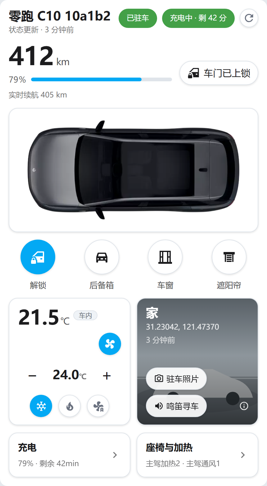
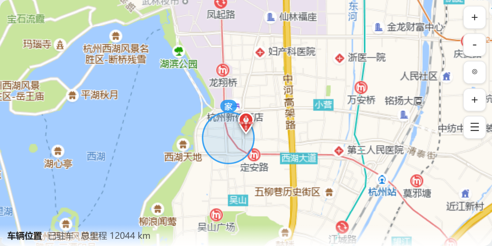
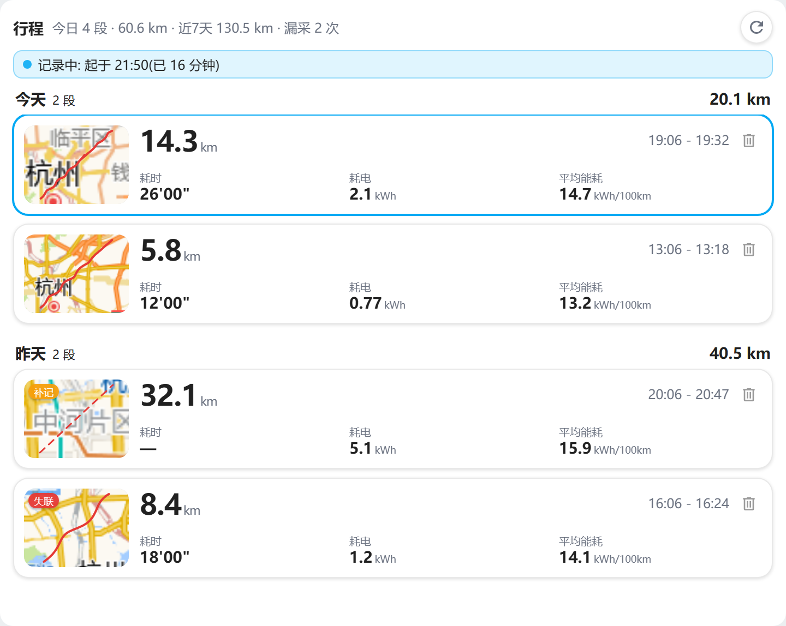
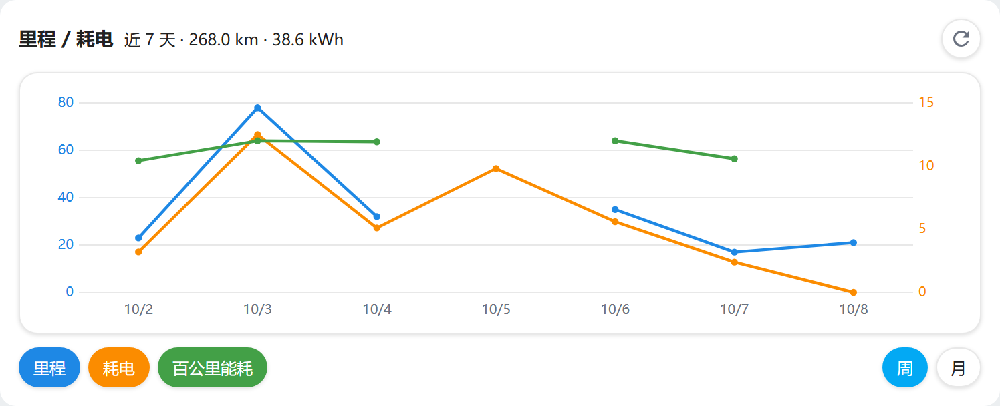
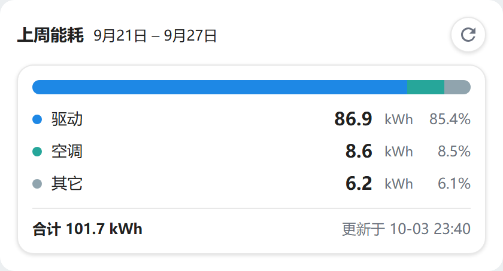

# 卡片展示

集成自带五张前端卡片(安装后自动注册为 Lovelace 资源, 在任意仪表盘里直接添加即可)。
下面是各卡的界面预览 —— **由离线渲染生成、数据为模拟值**(示例坐标取自公开地点),
不包含任何真实账号、位置或隐私信息。

---

## 车辆控制卡 `custom:leapmotor-control`

App 风格的车辆控制: 车况顶栏(电量 / 续航 / 车锁 / 状态更新时间)+ 常用动作行
(解锁 · 后备箱 · 车窗 · 遮阳帘)+ 空调与座椅 + 充电 / 燃油 / 胎压;
车模按你的车型显示官方外观图(未收录车型自动回退内置简笔画)。

---

## 地图卡 `custom:leapmotor-map`

高德底图(国内网络直接可用), 车辆位置实时跟随; 可在卡片上**拖圆创建地理围栏**,
围栏随地图拖动实时同步; 轨迹与围栏的坐标基准自动对齐, 不用手工换算。

---

## 行程卡 `custom:leapmotor-trips`

每段行程一张带**地图缩略图**的小卡(里程 / 耗时 / 耗电 / 平均能耗), 点开是轨迹详情大图;
补记(无轨迹)与失联的行程带角标区分。

---

## 里程 / 耗电卡 `custom:leapmotor-energy`

逐日折线(周 / 月切换): 里程(蓝) · 耗电(橙) · 百公里能耗(绿)三线可叠显;
点某天浮出当天数值, 耗电行还带官方口径的 **驱动 / 空调 / 其它** 拆分。

---

## 上周能耗卡 `custom:leapmotor-lastweek`

上一整周的能耗拆分(驱动 / 空调 / 其它): 比例堆叠条 + 各项 kWh 与占比 + 合计。

---

> 卡片的详细配置(线系列开关、时间范围、主题适配等)见 [dashboard.md](dashboard.md);
> 行程记录的原理与实体说明见 [trips.md](trips.md)。
